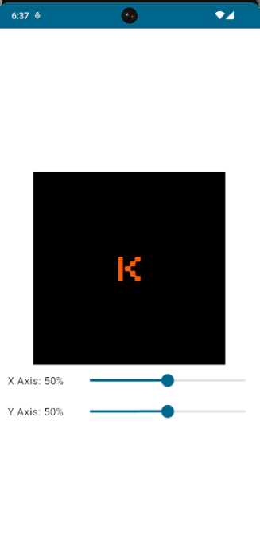

# Android 2023 Fall Android Bootcamp Homework

This public repo contains all the code necessary for the Kodeco 2023 Fall Android Bootcamp. For more information about Kodeco, please head over to kodeco.com. You can also find out more about the live bootcamps over at https://store.kodeco.com/bootcamp/android

Week 2: 

Updated the app to use an image for the center point. The app now supports landscape and portrait orientations. 

Week 1: 

Added a very simple app that tracks the x,y coordinates

